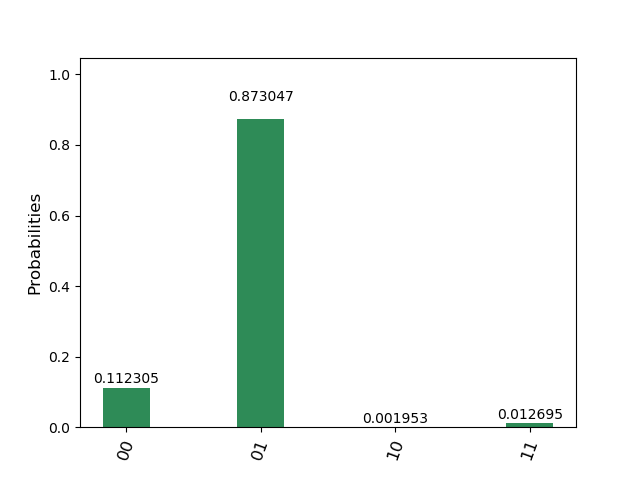

# ベルンシュタインヴァジラニアルゴリズム
## bernstein_vazirani_oracle.py
ベルンシュタインヴァジラニ問題の量子オラクル。  
2ビット版と3ビット版の一例のみ。
## bernstein_vazirani_sim.py
ベルンシュタインヴァジラニアルゴリズムをシミュレータで実行。
## bernstein_vazirani_real.py
ベルンシュタインヴァジラニアルゴリズムを実機で実行。  
https://quantumexperience.ng.bluemix.net/qx/experience  
のMy Account->Advancedからトークンを取得して(会員登録が必要)、  
コード中のTOKENに取得した文字列を代入してください。
## 例
a=(1, 0)  
に対応する量子オラクル(Uf_2)。  
'ibmqx4'(実機)で実行。
```bash
$ python bernstein_vazirani_real.py
COMPLETED
{'time': 19.76747989654541, 'counts': {'00': 115, '01': 894, '10': 2, '11': 13}, 'date': '2018-07-13T00:17:16.887Z'}
```
  

ここでは番号の若いキュービットが右にくるように表示されているので理論値は01です。  
実機なので誤差が生じています。
## 注意
- 3ビット版のプログラムは制御NOTゲートを配置する場所の制限によりibmqx4(実機)では実行できません。
