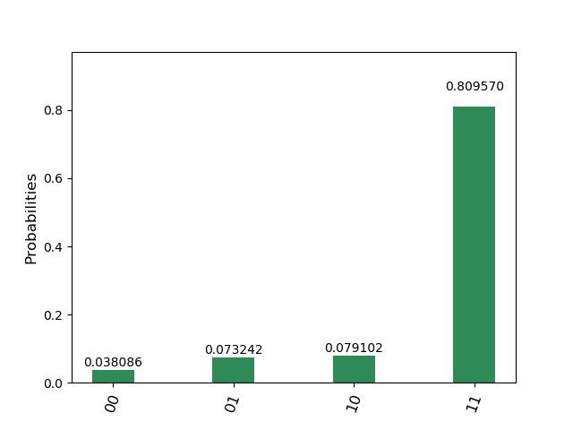

# ドイチアルゴリズム
## deutsch_oracle.py
ドイチ問題の量子オラクル。
## deutsch_sim.py
ドイチアルゴリズムをシミュレータで実行。
## deutsch_real.py
ドイチアルゴリズムを実機で実行。  
https://quantumexperience.ng.bluemix.net/qx/experience  
のMy Account->Advancedからトークンを取得して(会員登録が必要)、  
コード中のTOKENに取得した文字列を代入してください。
## 例
f(0)=0, f(1)=1  
を満たす量子オラクル(Uf_01)。  
'ibmqx4'(実機)で実行。
```bash
$ python deutsch_real.py
COMPLETED
{'time': 19.891658782958984, 'counts': {'00': 39, '01': 75, '10': 81, '11': 829}, 'date': '2018-07-12T23:45:24.485Z'}
```
  

理論値は11ですが実機なので誤差が生じています。
