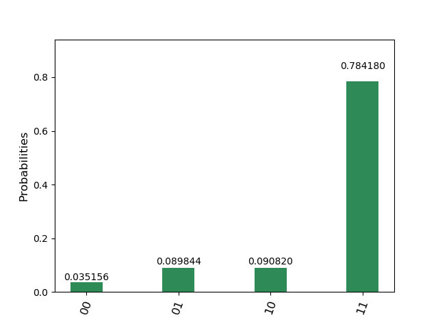

# ドイチジョザアルゴリズム
## deutsch_jozsa_oracle.py
ドイチジョザ問題の量子オラクル。  
2ビット版のみ。
## deutsch_jozsa_sim.py
ドイチジョザアルゴリズムをシミュレータで実行。
## deutsch_jozsa_real.py
ドイチジョザアルゴリズムを実機で実行。  
https://quantumexperience.ng.bluemix.net/qx/experience  
のMy Account->Advancedからトークンを取得して(会員登録が必要)、  
コード中のTOKENに取得した文字列を代入してください。
## 例
f(00)=f(11)=1, f(10)=f(01)=0  
を満たす量子オラクル(Uf_b2_6)。  
'ibmqx4'(実機)で実行。  
数十分かかりました(恐らく実行の順番待ちのため)。
```bash
$ python deutsch_jozsa_real.py
COMPLETED
{'time': 19.97472882270813, 'counts': {'00': 36, '01': 92, '10': 93, '11': 803}, 'date': '2018-07-12T22:50:16.976Z'}
```
  

理論値は11ですが実機なので誤差が生じています。
